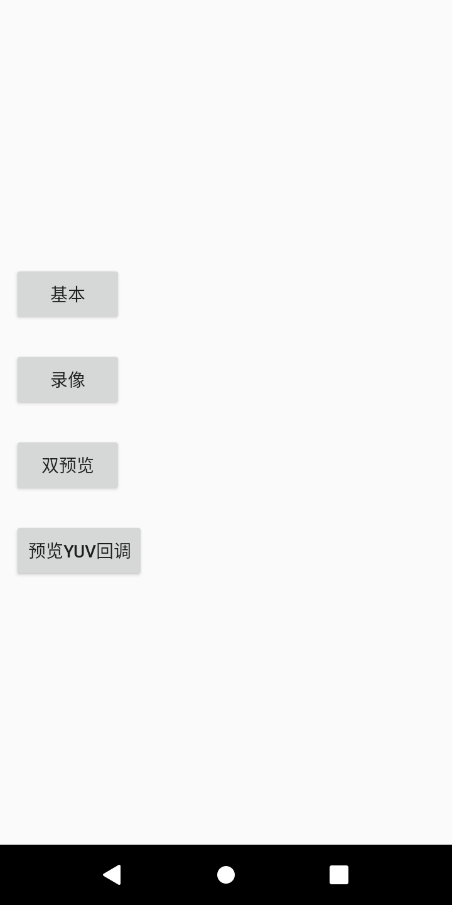

AndroidCamera2Demo
=================================================

### 交流

欢迎关注 微信公众号:小驰笔记

简书：https://www.jianshu.com/u/ee0e099895bf

// *****************************************************
深圳上班，

生活简简单单，

14年开始从事Android Camera相关软件开发工作，

做过车载、手机、执法记录仪......

公众号记录生活和工作的点滴，

关注“小驰笔记”，期待和你相遇~
// *****************************************************

    

### 介绍
> 本项目基于Google 提供的Cameras Demo进行改动
> Camera2 API,实现基本的功能，预览、拍照、录像;
> 陆续也会添加：预览yuv回调、人脸识别、慢动作录像等功能;

### 项目截图
这里简单截取了几个界面，更多功能自己去发现吧

    
    

### 开发环境
- Windows 7
- Android Studio 3.5.2

### 功能与 TODO
**App部分功能**
- [x] 预览、拍照、录像
- [x] 预览yuv数据回调;

### 参与贡献
欢迎stat，欢迎参与 😁

